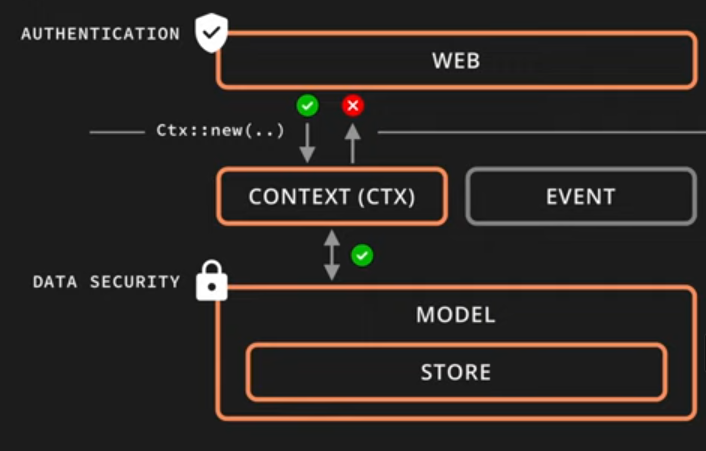

https://www.youtube.com/watch?v=XZtlD_m59sM
https://www.youtube.com/watch?v=3cA_mk4vdWY&list=PL7r-PXl6ZPcCIOFaL7nVHXZvBmHNhrh_Q

- run with `make run`
- quick_dev with `make quick_dev`

- create test db with `make postgres`
- access db with `make psql` then `\c app_db` then `\d` to list the tables

- (optional) For pg to print all sql statements. In psql command line started above:
  `ALTER DATABASE postgres SET log_statement = 'all';`

# Design

Idea is to have auth at the web layer to provide a context.
Then all privileges are done at the model layer, and assume context is provided
